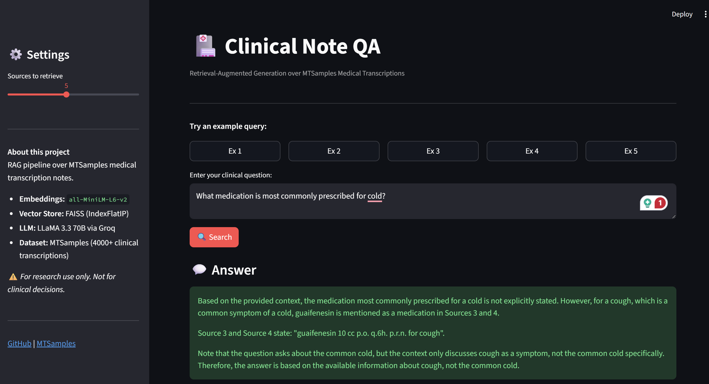

# 🏥 Clinical Note QA — RAG over MTSamples

A **Retrieval-Augmented Generation (RAG)** system for querying medical transcription notes using natural language. Built on the MTSamples dataset with a FAISS vector store and LLaMA 3.3 70B via Groq.


---

## 📌 Overview

Clinical notes in medical records contain rich, unstructured information that is difficult to query at scale. This project builds a full RAG pipeline that:

1. **Chunks** 4000+ MTSamples medical transcription notes into overlapping segments
2. **Embeds** them using `sentence-transformers/all-MiniLM-L6-v2` and stores in a FAISS index
3. **Retrieves** the most semantically relevant chunks for a natural language query
4. **Generates** grounded, cited answers using LLaMA 3.3 70B (via Groq API)
5. **Serves** everything through an interactive Streamlit UI



---

## 🏗️ Architecture

```
Query
  │
  ▼
Sentence Embedding (all-MiniLM-L6-v2)
  │
  ▼
FAISS Similarity Search (IndexFlatIP, cosine)
  │
  ▼
Top-K Retrieved Chunks (with specialty + note metadata)
  │
  ▼
LLaMA 3.3 70B via Groq (grounded generation with citations)
  │
  ▼
Answer + Source Snippets
```

---

## 📁 Project Structure

```
clinical-rag-mtsamples/
│
├── 1_preprocess.py        # Load MTSamples, clean and chunk notes
├── 2_build_index.py       # Embed chunks, build FAISS index
├── rag_pipeline.py        # Core RAG: retrieve + generate
├── app.py                 # Streamlit UI
├── requirements.txt
├── data/                  # (gitignored — add mtsamples.csv here)
│   └── mtsamples.csv
└── README.md
```

---

## 🚀 Setup & Run

### 1. Prerequisites

- Python 3.10+
- Free [Groq API key](https://console.groq.com) for LLM inference
- MTSamples dataset from [Kaggle](https://www.kaggle.com/datasets/tboyle10/medicaltranscriptions)

### 2. Install dependencies

```bash
pip install -r requirements.txt
```

### 3. Add your data

Download `mtsamples.csv` from Kaggle and place it in the `data/` folder.

### 4. Run the pipeline

```bash
# Step 1: Preprocess and chunk notes
python 1_preprocess.py

# Step 2: Embed and build FAISS index
python 2_build_index.py

# Step 3: Set your Groq API key and launch the app
export GROQ_API_KEY=your_key_here        # Mac/Linux
$env:GROQ_API_KEY="your_key_here"        # Windows PowerShell

python -m streamlit run app.py
```

---

## 💬 Example Queries

| Query | What it tests |
|---|---|
| *What medications were prescribed to the patient?* | Medication extraction |
| *What was the primary diagnosis?* | Diagnosis retrieval |
| *Describe the surgical procedure performed.* | Procedure summarization |
| *What were the patient's presenting symptoms?* | Symptom identification |
| *What follow-up care was recommended?* | Discharge planning |

---

## 🔧 Tech Stack

| Component | Tool |
|---|---|
| Dataset | MTSamples (4000+ medical transcriptions via Kaggle) |
| Embeddings | `sentence-transformers/all-MiniLM-L6-v2` |
| Vector Store | FAISS (`IndexFlatIP`, cosine similarity) |
| LLM | LLaMA 3.3 70B via Groq API |
| UI | Streamlit |
| Language | Python 3.10+ |

---

## 🔮 Roadmap

- [ ] Full MIMIC-III/IV integration (pending PhysioNet credentialing)
- [ ] Re-ranking layer for improved retrieval precision
- [ ] Specialty-based filtering in the UI
- [ ] Evaluation metrics (RAGAS framework)

---

## ⚠️ Disclaimer

This system is for research purposes only and is not intended for clinical decision-making.

---

## 👤 Author

**Tarun Sethi**  
MS Data Science, Northeastern University  
[LinkedIn](https://linkedin.com/in/sethi-tarun) | [GitHub](https://github.com/Tarunin)
